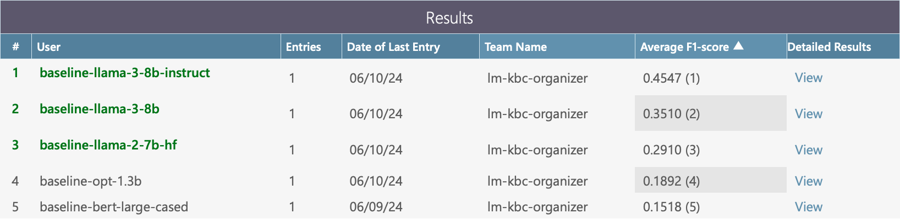

# LM-KBC: Knowledge Base Construction from Pre-trained Language Models (3rd Edition)

This repository hosts data for the LM-KBC challenge at ISWC
2024 (https://lm-kbc.github.io/challenge2024/).

This repository contains:

- The dataset for the challenge
- Evaluation script
- Baselines
- Instructions for submitting your predictions

## Table of contents

1. [News](#news)
2. [Challenge overview](#challenge-overview)
3. [Dataset](#dataset)
4. [Evaluation metrics](#evaluation-metrics)
5. [Getting started](#getting-started)
    - [Setup](#setup)
    - [Baselines](#baselines)
        - [Baseline 1: bert-large-cased](#baseline-1-bert-large-cased)
        - [Baseline 2: facebook/opt-1.3b](#baseline-2-facebookopt-13b)
        - [Baseline 3: meta-llama/llama-2-7b-hf](#baseline-3-meta-llamallama-2-7b-hf)
        - [Baseline 4: meta-llama/Meta-Llama-3-8B](#baseline-4-meta-llamameta-llama-3-8b)
        - [Baseline 5: meta-llama/Meta-Llama-3-8B-Instruct](#baseline-5-meta-llamameta-llama-3-8b-instruct)
    - [How to structure your prediction file](#how-to-structure-your-prediction-file)
    - [Submit your predictions to CodaLab](#submit-your-predictions-to-codalab)

## News

- 22.4.2024: Release of dataset v1.0
- 25.3.2024: Release of preliminary evaluation script and GPT-baseline

## Challenge overview

Pretrained language models (LMs) like ChatGPT have advanced a range of semantic
tasks and have also shown promise for
knowledge extraction from the models itself. Although several works have
explored this ability in a setting called
probing or prompting, the viability of knowledge base construction from LMs
remains under-explored. In the 3rd edition
of this challenge, we invite participants to build actual disambiguated
knowledge bases from LMs, for given subjects and
relations. In crucial difference to existing probing benchmarks like
LAMA ([Petroni et al., 2019](https://arxiv.org/pdf/1909.01066.pdf)), we make no
simplifying assumptions on relation
cardinalities, i.e., a subject-entity can stand in relation with zero, one, or
many object-entities. Furthermore,
submissions need to go beyond just ranking predicted surface strings and
materialize disambiguated entities in the
output, which will be evaluated using established KB metrics of precision and
recall.

> Formally, given the input subject-entity (s) and relation (r), the task is to
> predict all the correct
> object-entities ({o<sub>1</sub>, o<sub>2</sub>, ..., o<sub>k</sub>}) using LM
> probing.

## Dataset

Number of unique subject-entities in the data splits.

<table>
<thead>
    <tr>
        <th>Relation</th>
        <th>Train</th>
        <th>Val</th>
        <th>Test</th>
        <th>Special features</th>
    </tr>
</thead>
<tbody>
    <tr>
        <td>countryLandBordersCountry</td>
        <td>63</td>
        <td>63</td>
        <td>63</td>
        <td>Null values possible</td>
    </tr>
    <tr>
        <td>personHasCityOfDeath</td>
        <td>100</td>
        <td>100</td>
        <td>100</td>
        <td>Null values possible</td>
    </tr>
    <tr>
        <td>seriesHasNumberOfEpisodes</td>
        <td>100</td>
        <td>100</td>
        <td>100</td>
        <td>Object is numeric</td>
    </tr>
    <tr>
        <td>awardWonBy</td>
        <td>10</td>
        <td>10</td>
        <td>10</td>
        <td>Many objects per subject</td>
    </tr>
    <tr>
        <td>companyTradesAtStockExchange</td>
        <td>100</td>
        <td>100</td>
        <td>100</td>
        <td>Null values possible</td>
    </tr>
</tbody>
</table>

## Evaluation metrics

We evaluate the predictions using macro precision, recall, and F1-score.
See the evaluation script ([evaluate.py](evaluate.py)) for more details.

```bash
python evaluate.py \
  -g data/val.jsonl \
  -p data/testrun-XYZ.jsonl
```

Parameters: ``-g`` (the ground truth file), ``-p`` (the prediction file).

## Getting started

### Setup

1. Clone this repository:

    ```bash
    mkdir lm-kbc-2024
    cd lm-kbc-2024
    git clone https://github.com/lm-kbc/dataset2024.git
    cd dataset2024
    ```

2. Create a virtual environment and install the requirements:

    ```bash
    conda create -n lm-kbc-2024 python=3.12.1
    ```

    ```bash
    conda activate lm-kbc-2024
    pip install -r requirements.txt
    ```

3. Write your own solution and generate predictions (format described
   in [How to structure your prediction file](#how-to-structure-your-prediction-file)).
4. Evaluate your predictions using the evaluation script
   (see [Evaluation metrics](#evaluation-metrics)).
5. Submit your solutions to the organizers
   (
   see [Call for Participants](https://lm-kbc.github.io/challenge2024/#call-for-participants)),
   and/or submit your predictions to CodaLab
   (
   see [Submit your predictions to CodaLab](#submit-your-predictions-to-codalab)).

### Baselines

We provide baselines using Masked Language
Models ([models/baseline_fill_mask_model.py](models/baseline_fill_mask_model.py)),
Autoregressive Language
Models ([models/baseline_generation_model.py](models/baseline_generation_model.py)),
and Llama-3 chat models ([models/baseline_llama_3_chat_model.py](models/baseline_llama_3_chat_model.py)),

You can run these baselines via the [baseline.py](baseline.py) script and
providing it with the corresponding configuration file. We provide example
configuration files for the baselines in the [configs](configs) directory.

#### Baseline 1: bert-large-cased

Config
file: [configs/baseline-bert-large-cased.yaml](configs/baseline-bert-large-cased.yaml)

```bash
python baseline.py -c configs/baseline-bert-large-cased.yaml -i data/val.jsonl
python evaluate.py -g data/val.jsonl -p output/baseline-bert-large-cased.jsonl
```

Results:

```text
                              macro-p  macro-r  macro-f1  micro-p  micro-r  micro-f1  avg. #preds  #empty preds
awardWonBy                      0.300    0.000     0.000    0.000    0.000     0.000        1.000             3
companyTradesAtStockExchange    0.000    0.350     0.000    0.000    0.000     0.000        2.810             0
countryLandBordersCountry       0.632    0.702     0.487    0.628    0.508     0.562        2.132             1
personHasCityOfDeath            0.290    0.630     0.242    0.115    0.327     0.171        1.560            16
seriesHasNumberOfEpisodes       1.000    0.000     0.000    1.000    0.000     0.000        0.000           100
*** All Relations ***           0.463    0.386     0.152    0.184    0.058     0.088        1.566           120
```

#### Baseline 2: facebook/opt-1.3b

Config file: [configs/baseline-opt-1.3b.yaml](configs/baseline-opt-1.3b.yaml)

```bash
python baseline.py -c configs/baseline-opt-1.3b.yaml -i data/val.jsonl
python evaluate.py -g data/val.jsonl -p output/baseline-opt-1.3b.jsonl
```

Results:

```text
                              macro-p  macro-r  macro-f1  micro-p  micro-r  micro-f1  avg. #preds  #empty preds
awardWonBy                      0.500    0.000     0.000    0.000    0.000     0.000        0.600             5
companyTradesAtStockExchange    0.430    0.475     0.267    0.120    0.165     0.139        1.080            30
countryLandBordersCountry       0.548    0.441     0.272    0.290    0.223     0.252        2.029            25
personHasCityOfDeath            0.400    0.520     0.230    0.093    0.127     0.108        0.750            33
seriesHasNumberOfEpisodes       0.130    0.030     0.030    0.033    0.030     0.032        0.900            10
*** All Relations ***           0.366    0.350     0.188    0.151    0.033     0.055        1.103           103
```

#### Baseline 3: meta-llama/llama-2-7b-hf

Config
file: [configs/baseline-llama-2-7b-hf.yaml](configs/baseline-llama-2-7b-hf.yaml)

```bash
export HUGGING_FACE_HUB_TOKEN=your_token
python baseline.py -c configs/baseline-llama-2-7b-hf.yaml -i data/val.jsonl
python evaluate.py -g data/val.jsonl -p output/baseline-llama-2-7b-hf.jsonl
```

Results:

```text
                              macro-p  macro-r  macro-f1  micro-p  micro-r  micro-f1  avg. #preds  #empty preds
awardWonBy                      0.600    0.007     0.013    0.333    0.001     0.003         0.60             4
companyTradesAtStockExchange    0.520    0.558     0.352    0.316    0.304     0.310         0.76            29
countryLandBordersCountry       0.761    0.789     0.628    0.676    0.642     0.659         2.50             9
personHasCityOfDeath            0.410    0.600     0.250    0.197    0.273     0.229         0.76            26
seriesHasNumberOfEpisodes       0.080    0.070     0.070    0.071    0.070     0.070         0.99             1
*** All Relations ***           0.420    0.467     0.291    0.382    0.086     0.141         1.13            69
```

#### Baseline 4: meta-llama/Meta-Llama-3-8B

Config
file: [configs/baseline-llama-3-8b.yaml](configs/baseline-llama-3-8b.yaml)

```bash
export HUGGING_FACE_HUB_TOKEN=your_token
python baseline.py -c configs/baseline-llama-3-8b.yaml -i data/val.jsonl
python evaluate.py -g data/val.jsonl -p output/baseline-llama-3-8b.jsonl
```

Results:

```text
                              macro-p  macro-r  macro-f1  micro-p  micro-r  micro-f1  avg. #preds  #empty preds
awardWonBy                      0.485    0.014     0.024    0.611    0.007     0.015        1.800             4
companyTradesAtStockExchange    0.600    0.621     0.406    0.431    0.392     0.411        0.720            30
countryLandBordersCountry       0.884    0.746     0.660    0.864    0.603     0.711        1.838            24
personHasCityOfDeath            0.490    0.610     0.310    0.219    0.291     0.250        0.730            33
seriesHasNumberOfEpisodes       0.170    0.160     0.160    0.162    0.160     0.161        0.990             1
*** All Relations ***           0.505    0.502     0.351    0.470    0.096     0.160        1.024            92
```

#### Baseline 5: meta-llama/Meta-Llama-3-8B-Instruct

Config
file: [configs/baseline-llama-3-8b-instruct.yaml](configs/baseline-llama-3-8b-instruct.yaml)

```bash
export HUGGING_FACE_HUB_TOKEN=your_token
python baseline.py -c configs/baseline-llama-3-8b-instruct.yaml -i data/val.jsonl
python evaluate.py -g data/val.jsonl -p output/baseline-llama-3-8b-instruct.jsonl
```

Results:

```text
                              macro-p  macro-r  macro-f1  micro-p  micro-r  micro-f1  avg. #preds  #empty preds
awardWonBy                      0.238    0.028     0.045    0.352    0.025     0.047       10.500             0
companyTradesAtStockExchange    0.540    0.703     0.474    0.410    0.519     0.458        1.000            21
countryLandBordersCountry       0.961    0.912     0.919    0.950    0.855     0.900        2.368            18
personHasCityOfDeath            0.700    0.600     0.460    0.326    0.273     0.297        0.460            55
seriesHasNumberOfEpisodes       0.493    0.160     0.155    0.229    0.160     0.188        0.700            34
*** All Relations ***           0.638    0.552     0.455    0.544    0.139     0.221        1.275           128
```

### How to structure your prediction file

Your prediction file should be in the jsonl format.
Each line of a valid prediction file contains a JSON object which must
contain at least 3 fields to be used by the evaluation script:

- ``SubjectEntity``: the subject entity (string)
- ``Relation``: the relation (string)
- ``ObjectEntitiesID``: the predicted object entities ID, which should be a list
  of Wikidata IDs (strings).

This is an example of how to write a prediction file:

```python
import json

# Dummy predictions
predictions = [
    {
        "SubjectEntity": "Dominican republic",
        "Relation": "CountryBordersWithCountry",
        "ObjectEntitiesID": ["Q790", "Q717", "Q30", "Q183"]
    },
    {
        "SubjectEntity": "Eritrea",
        "Relation": "CountryBordersWithCountry",
        "ObjectEntitiesID": ["Q115"]
    },
    {
        "SubjectEntity": "Estonia",
        "Relation": "CountryBordersWithCountry",
        "ObjectEntitiesID": []
    }

]

fp = "./path/to/your/prediction/file.jsonl"

with open(fp, "w") as f:
    for pred in predictions:
        f.write(json.dumps(pred) + "\n")
```

### Submit your predictions to CodaLab

Links to the CodaLab competition leaderboard:
- Validation leaderboard: [LM-KBC @ ISWC 2024 (validation)](https://codalab.lisn.upsaclay.fr/competitions/19137)
- Test leaderboard: will be released with the test dataset

To participate in the competition and join the leaderboard, sign up for your team account at [CodaLab](https://codalab.lisn.upsaclay.fr).
Then register for the competition and submit your predictions at Participate -> Submit / View Results.

We have also uploaded the baseline results:

